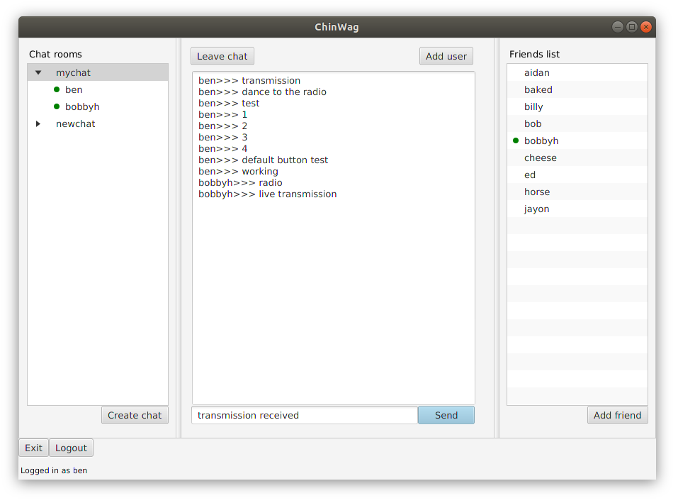
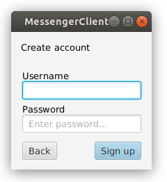
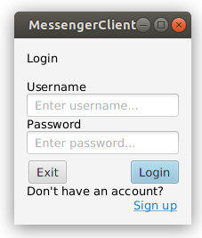

# chinwag

MSc Java group project: chat application.

* Multi-threaded, using dynamic thread pool
* Client-server architecture
* Communication over socket connection
* Chat history stored in PostgreSQL database
* Passwords stored as salted hashes in database
* GUI client written in JavaFX

## Main application window

## Account creation and login windows

 | 
